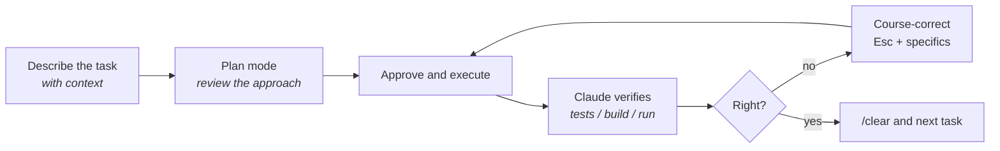

# Using It Well

Claude Code will happily do exactly what you ask — including the wrong thing, confidently. The difference between a tool that saves you hours and one that wastes them is almost entirely **how you drive it**. These are the habits that matter.

### 1. Plan before you edit

For anything beyond a one-line change, hit `Shift`+`Tab` to enter **plan mode**. Claude explores the code and proposes an approach _without_ touching files. Read the plan, correct wrong assumptions, then approve.


Fixing a plan costs one message. Unwinding ten bad edits costs a `/clear` and your patience. Plan mode is the single cheapest quality lever you have.


### 2. Keep tasks small and scoped

One task = one clear outcome. "Add input validation to the signup form" is a good task. "Refactor the whole auth system" is a project — break it into steps and do them one at a time. Small tasks are easier to review, easier to roll back, and keep Claude from drifting.

### 3. `/clear` between unrelated tasks

Context is a resource. When you finish a task and move to something unrelated, run `/clear` to wipe the conversation. A fresh context is faster, cheaper, and won't drag stale assumptions from the last task into this one.

```
/clear     # start the next task with a clean slate
```

### 4. Give it context instead of hoping it guesses

Claude reads code well, but it can't read your mind or your ticket tracker. Point it at what matters:

* `@src/auth/session.ts` — reference a file directly so it reads the right one.
* Paste the error message, the failing test output, the relevant log lines.
* Say _why_, not just _what_ — "users are getting logged out randomly" beats "fix the session bug."

The best long-term version of this is a good [CLAUDE.md](claude-md.md) — context Claude loads automatically every session.

### 5. Let it verify its own work

Claude is far more reliable when it can _check_ itself. Tell it how:

> "Run the tests after each change and fix anything that breaks."
> "Start the dev server and confirm the page loads before you call it done."

If your project has a build, lint, or test command, make sure Claude knows it (put it in CLAUDE.md). An agent that runs `npm test` and reads the output catches its own mistakes; one that doesn't will cheerfully hand you broken code.

### 6. Course-correct early, don't suffer in silence

If it's heading the wrong way, hit `Esc` to interrupt — don't wait for it to finish a doomed approach. Redirect with specifics: "stop, you're editing the wrong file, the logic lives in `handlers/`, not `routes/`."

### 7. Run your own commands with `!`

Anything you prefix with `!` runs in the session and its output goes straight into the conversation — handy for logins or interactive commands Claude can't drive itself:

```
! gh auth login
! docker compose up -d
```

### 8. Reach for subagents on big, parallelizable work

For large tasks, Claude can dispatch **subagents** that work independently and report back — great for "search the whole codebase for X" or running several independent changes at once. You don't have to manage this manually; just know that "explore these three modules in parallel" is a thing it can do, and it keeps your main context clean.

### The mental model




None of this is exotic — it's the same discipline as working with a fast, capable junior who has no memory of yesterday. Give clear scope, let them show their plan, make them test their work, and start each new thing fresh.

