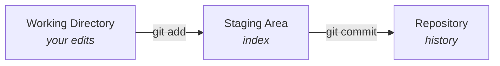

# Git Basics

If you only learn a handful of Git commands, learn these. Everything else in this section builds on them.

### The mental model

A commit is a **snapshot** of your files at a point in time. Changes move through three places before they become a commit:



* **Working directory** — the files you're editing right now.
* **Staging area (index)** — the changes you've marked to go into the next commit.
* **Repository** — the committed history.

### Starting a repo

```bash
git init                      # turn the current folder into a repo
git clone <url>               # copy an existing remote repo
```

### The everyday loop

```bash
git status                    # what changed? what's staged?
git add <file>                # stage a file (use . for everything)
git commit -m "message"       # snapshot the staged changes
git push                      # send commits to the remote
```

Pull in other people's changes before you push:

```bash
git pull                      # fetch + merge the remote into your branch
```


`git pull` is really two steps: `git fetch` (download remote commits, change nothing locally) followed by `git merge` (combine them into your branch). When you want to _look_ before integrating, run `git fetch` on its own first.


### Ignoring files

Create a `.gitignore` file so build output, secrets, and dependencies never get committed:

```gitignore
node_modules/
.env
dist/
*.log
```


`.gitignore` only affects **untracked** files. If something is already committed, ignoring it later won't remove it — run `git rm --cached <file>` first.


### Branches

A branch is just a movable pointer to a commit. Use one per feature or fix:

```bash
git switch -c <new-branch>    # create and switch to a new branch
git switch <branch>           # switch to an existing one
git merge <branch>            # merge another branch into the current one
```

See [Managing Branches](managing-branches.md) for renaming, upstreams, and deletion.

### Undo & rescue

```bash
git restore <file>            # discard uncommitted changes to a file
git restore --staged <file>   # unstage, but keep the edits
git stash                     # shelve all changes to come back to later
git stash pop                 # bring the shelved changes back
```

For moving `HEAD` between commits, see [Reset and Switch](reset-and-switch.md). For editing commits that already exist, see [Rename / Edit / Squash commit(s)](renaming-a-pushed-commit.md).

### Merge vs. rebase (the short version)

Both combine work from two branches; they differ in the history they leave behind:

* **Merge** keeps both histories and adds a merge commit. Safe, non-destructive, but the graph can get noisy.
* **Rebase** replays your commits on top of another branch for a straight, linear history — but it _rewrites_ commits, so never rebase commits others have already pulled.

A good default: **merge** to bring shared branches together, **rebase** to tidy up your own local work before sharing it.

### Tags

Tags mark a specific commit — usually a release:

```bash
git tag v1.0.0                # lightweight tag on the current commit
git tag -a v1.0.0 -m "..."    # annotated tag (recommended for releases)
git push origin v1.0.0        # tags aren't pushed by default
```
