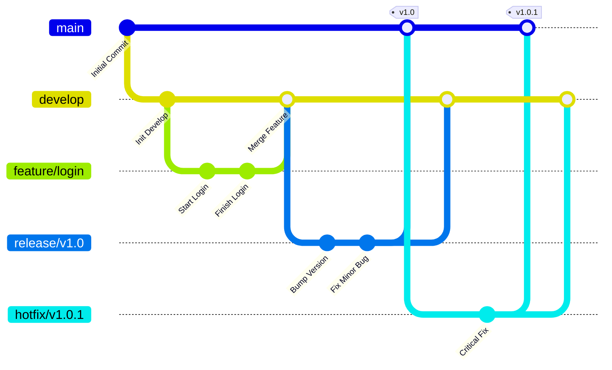
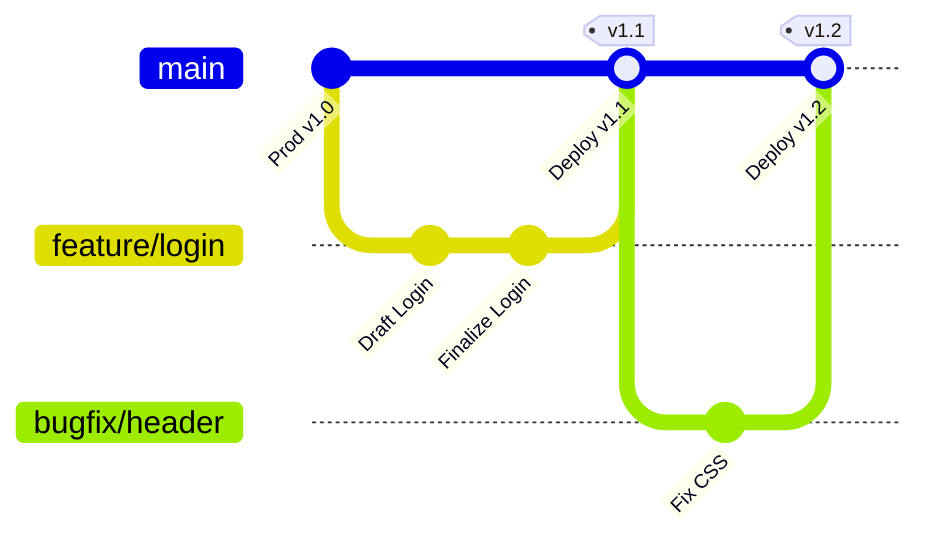
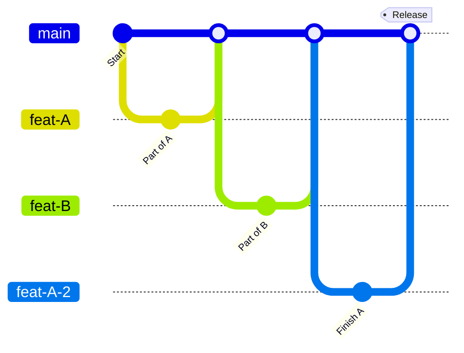

# Git Workflows

### Gitflow

### Github Flow

This is the most popular alternative to Gitflow. It is much simpler because it removes the develop branch. It is designed for web applications where you deploy to production many times a day.

### Trunk-based

This is the workflow used by high-performance teams (Google, Facebook, Netflix). The goal is to avoid "merge hell" by keeping branches incredibly short-lived (often less than a day).

