# Introduction

## What is it ?

```mermaid
flowchart TB
    %% --- Dark Mode Styling ---
    classDef app fill:#334155,stroke:#94a3b8,color:#fff,stroke-width:1px;
    classDef heavy fill:#7f1d1d,stroke:#f87171,color:#fff,stroke-width:2px;
    classDef light fill:#064e3b,stroke:#34d399,color:#fff,stroke-width:2px;
    classDef infra fill:#1e293b,stroke:#475569,color:#fff,stroke-width:1px;

    %% --- VIRTUAL MACHINES ---
    subgraph VM_Group ["❌ Virtual Machines (Duplicated Resources)"]
        direction TB
        
        subgraph VM1 ["VM 1"]
            A1["App A"]:::app
            G1["Guest OS (GBs)"]:::heavy
            A1 --> G1
        end

        subgraph VM2 ["VM 2"]
            A2["App B"]:::app
            G2["Guest OS (GBs)"]:::heavy
            A2 --> G2
        end
        
        Hyper["Hypervisor"]:::infra
        G1 --> Hyper
        G2 --> Hyper
        
        Hardware1["Infrastructure"]:::infra
        Hyper --> Hardware1
    end

    %% --- DOCKER CONTAINERS ---
    subgraph Docker_Group ["✅ Docker Containers (Shared Resources)"]
        direction TB
        
        subgraph C1 ["Container 1"]
            D1["App A"]:::app
        end

        subgraph C2 ["Container 2"]
            D2["App B"]:::app
        end
        
        Engine["🐳 Docker Engine"]:::light
        D1 --> Engine
        D2 --> Engine
        
        Hardware2["Infrastructure"]:::infra
        Engine --> Hardware2
    end

    %% --- Subgraph Backgrounds ---
    style VM_Group fill:#171717,stroke:#525252,color:#fff
    style Docker_Group fill:#0f172a,stroke:#1e40af,color:#fff
    style VM1 fill:none,stroke:none,color:#fff
    style VM2 fill:none,stroke:none,color:#fff
    style C1 fill:none,stroke:none,color:#fff
    style C2 fill:none,stroke:none,color:#fff
```




### Videos

* 100s [https://youtu.be/Gjnup-PuquQ](https://youtu.be/Gjnup-PuquQ)
* 5m [https://youtu.be/\_dfLOzuIg2o](https://youtu.be/_dfLOzuIg2o)
* 10m [https://youtu.be/DQdB7wFEygo](https://youtu.be/DQdB7wFEygo)

### Websites

[https://average.joe.dev/awesome-docker/](https://average.joe.dev/awesome-docker/)

[https://awesome-docker-compose.com/](https://awesome-docker-compose.com/)

[https://compose.ajnart.dev/](https://compose.ajnart.dev/)

[https://nuxx.io/](https://nuxx.io/)

## Installation

### Most Linux Distros

[https://docs.docker.com/engine/install/](https://docs.docker.com/engine/install/)

```shellscript
curl -fsSL https://get.docker.com | sudo sh
sudo usermod -aG docker $USER
newgrp docker
```

### Arch Based Distros

```bash
paru -S --noconfirm docker docker-compose docker-buildx
sudo groupadd docker ; sudo usermod -aG docker $USER
```

Log out and log back in so that your group membership is re-evaluated.

## Basics

```bash
docker run -it --rm docker/doodle
```

### [Mounting](https://docs.docker.com/storage/bind-mounts/)

-v src[^1]:dest[^2]:ro[^3] OR --mount type=tmpfs[^4],src=folder1,dst=folder2

## [Dockerfile](https://docs.docker.com/reference/dockerfile/)

Dockerfile is used to build docker images (not containers), here is an example of Dockerfile

```docker
FROM debian:latest
LABEL maintainer="kp <info@kp.fr>"

RUN apt-get update \
    && apt-get install -y iputils-ping \
    && apt-get install -y traceroute \
    && apt-get install -y curl \
    && apt-get clean

CMD ["/usr/bin/bash"]
```

### Build & Push Image

You need a free [dockerhub](https://hub.docker.com/) account.

```bash
docker login --username yourmail@gmail.com
docker build -t you_username/your_image:latest .
docker push your_username/your_image:latest
```

## [Docker Compose](https://docs.docker.com/compose/)

### [Install](https://docs.docker.com/compose/install/)

```bash
sudo apt update
sudo apt install docker-compose-plugin
```

### Usage

The docker compose command makes the creation of containers easy. You first need to create a compose.yaml file, here is an example :


Be Careful: Each Docker Volume/Network used need to be created in the compose file outside of services (level 0 of yaml), see the end of the example. By default all of the containers will be created in the same docker network.


<pre class="language-yaml"><code class="lang-yaml">services:
  # MARIADB
  <a data-footnote-ref href="#user-content-fn-5">db</a>:
    image: mariadb:latest
    environment:
      MYSQL_RANDOM_ROOT_PASSWORD: 1
      MYSQL_DATABASE: blog
      MYSQL_USER: bloguser
      MYSQL_PASSWORD: pass123
    volumes:
      - dbvol:/var/lib/mysql
    networks:
      - blognet
    restart: always

  # PHPMYADMIN
  dbadmin:
    image: phpmyadmin/phpmyadmin:latest
    environment:
      PMA_HOST: db
    ports:
      - 9090:80
    networks:
      - blognet
    restart: always

  # WORDPRESS
  web:
    image: wordpress:latest
    environment:
      WORDPRESS_DB_HOST: db
      WORDPRESS_DB_USER: bloguser
      WORDPRESS_DB_PASSWORD: pass123
      WORDPRESS_DB_NAME: blog
    ports:
      - 9000:80
    networks:
      - blognet
    volumes:
      - webvol:/var/www/html/wp-content
    restart: always

volumes:
  dbvol:
  webvol:

networks:
  blognet:
</code></pre>

and run:

<pre class="language-bash" data-full-width="false"><code class="lang-bash">docker compose up <a data-footnote-ref href="#user-content-fn-6">-d</a>
</code></pre>

### Examples

### [Basic commands](https://docs.docker.com/reference/cli/docker/compose/)

* Run Docker Compose file: <mark style="color:red;">`docker compose up -d`</mark>
* Start all services: <mark style="color:red;">`docker compose up`</mark>
* Stop all services: <mark style="color:red;">`docker compose down`</mark>

[^1]: Src folder path or docker volume name

[^2]: Destination folder, inside container

[^3]: Read-Only

[^4]: optional

[^5]: hostname of container, can be used thanks to docker dns service

[^6]: (Optionnal) Detached mode: Run containers in the background
