# Virtual Environments

A Python virtual environment (venv) is an isolated environment that allows you to manage dependencies for different projects separately. This isolation helps avoid conflicts between packages and ensures that each project has access to the specific versions of libraries it needs.

```mermaid fullWidth="false"
flowchart TD
    %% --- Styles (Dark Mode) ---
    classDef error fill:#7f1d1d,stroke:#f87171,color:#fff,stroke-width:2px;
    classDef success fill:#064e3b,stroke:#34d399,color:#fff,stroke-width:2px;
    classDef system fill:#1e293b,stroke:#94a3b8,color:#fff;

    %% --- SCENARIO 1: The Problem ---
    subgraph Problem ["❌ Global Python (no venv)"]
        direction TB
        
        Sys["💻 System Python"]:::system
        Lib["📦 Requests v1.0<br/>(Only one version allowed!)"]:::system
        
        App1["App A<br/>(Needs v1.0)"]:::success
        App2["App B<br/>(Needs v2.0)"]:::error
        
        Sys --- Lib
        App1 -->|✅ Works| Lib
        App2 -->|💥 CRASH| Lib
    end

    style Problem fill:#262626,stroke:#525252,color:#fff
```

```mermaid
flowchart TD
    %% --- Styling Definitions ---
    classDef root fill:#171717,stroke:#fff,stroke-width:3px,color:#fff,rx:10,ry:10;
    classDef venv fill:#0f172a,stroke:#38bdf8,stroke-width:2px,color:#cbd5e1,rx:10,ry:10;

    %% --- 1. The Root (Top) ---
    %% "rx:10" gives it rounded corners like the image
    Root["💻 <b>Root Installation</b><br/>(System Python)"]:::root

    %% --- 2. The Branches ---
    Root --> ML
    Root --> Web
    Root --> Tools

    %% --- 3. The Isolated Venvs (Bottom) ---
    %% We use HTML <hr/> to separate the Title from the List
    
    ML["<b>🐍 AI / Data Venv</b><hr/>• Pandas<br/>• PyTorch<br/>• NumPy"]:::venv
    
    Web["<b>🐍 Web Backend Venv</b><hr/>• FastAPI<br/>• Uvicorn<br/>• SQLAlchemy"]:::venv
    
    Tools["<b>🐍 Scraping Venv</b><hr/>• Requests<br/>• BeautifulSoup<br/>• Selenium"]:::venv
```







1. [#installation](uv.md#installation "mention")
2. [#creating-and-using-venv](uv.md#creating-and-using-venv "mention")



**Creating and activating an environment** You can do this by running the following on a terminal [https://doc.qt.io/qtforpython-6/quickstart.html#quick-start:](https://doc.qt.io/qtforpython-6/quickstart.html#quick-start:)

* Create environment (Your Python executable might be called `python3`):

<pre class="language-bash"><code class="lang-bash"><a data-footnote-ref href="#user-content-fn-1">python</a> -m venv myenv
</code></pre>

* Activate the environment (Linux and macOS):

```bash
source myenv/bin/activate
```

* Activate the environment (Windows):

```powershell
.\myenv\Scripts\activate
```



1. [Install miniconda](https://docs.anaconda.com/miniconda/install/#quickstart-install-instructions) for example (and run conda init if not already)
2. Create env:

<pre class="language-bash"><code class="lang-bash"><strong>conda create <a data-footnote-ref href="#user-content-fn-2">--prefix FULL_PATH_ENV</a> <a data-footnote-ref href="#user-content-fn-3">python=3.12</a>
</strong></code></pre>

3. Activate venv:

<pre class="language-bash"><code class="lang-bash">conda activate <a data-footnote-ref href="#user-content-fn-4">FULL_PATH_ENV</a>
</code></pre>




[^1]: Your Python executable might be called `python3`

[^2]: you can replace this by myenv if you want to create in current dir

[^3]: you can ommit this, it'll use latest python

[^4]: 
