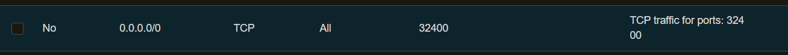

# Forward Port on Oracle Free Tier

Ouvrir le port dans l’interface Oracle>VNIC>Security List

<figure><figcaption></figcaption></figure>

```bash
# 1. The "Magic" NAT Rule (Ensures Docker/Translation works immediately)
sudo iptables -t nat -I PREROUTING 1 -p tcp --dport 14372 -j ACCEPT
# 2. The Input Rule (Allows the packet into the OS)
sudo iptables -I INPUT 1 -p tcp --dport 14372 -j ACCEPT
# 3. The Forward Rule (Allows the OS to hand the packet to Docker)
sudo iptables -I FORWARD 1 -p tcp --dport 14372 -j ACCEPT
sudo netfilter-persistent save  # (so it survives reboot)
```
