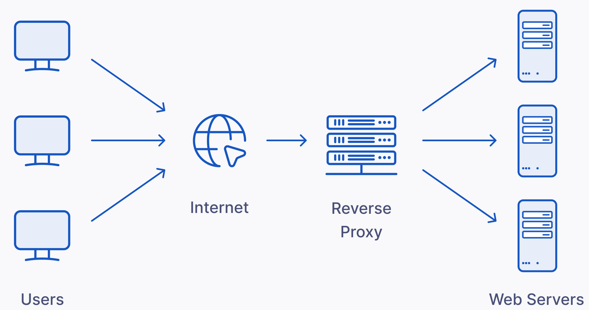

# Reverse Proxy

<figure><figcaption></figcaption></figure>

### **Why Use a Reverse Proxy?**

A reverse proxy is a server that sits between your client devices and your backend servers. It helps manage and distribute incoming traffic, providing benefits like improved **security**, **load balancing**, and **easier management** of multiple services. Setting up a reverse proxy can make accessing your Plex server and other services more seamless and secure. Using a reverse proxy, you can **map different services to subdomains** of your main domain. For example:

* [Vaultwarden](../../) service available at [http://yourserverip:11001](http://yourserverip:11001) can be turned into [https://vaultwarden.yourdomain.fr](../../)
* [Immich](https://github.com/immich-app/immich) at [http://yourserverip:2283](http://yourserverip:2283) -> [https://immich.yourdomain.fr](https://immich.yourdomain.fr)

### Choosing a reverse proxy server

You could use [Caddy](https://github.com/caddyserver/caddy) or [NPM](https://nginxproxymanager.com/) but [Traefik](https://doc.traefik.io/traefik/) is my personal favorite (if you like modern WebUI take a look at [GoDoxy](https://github.com/yusing/godoxy) and [Dokploy](https://github.com/Dokploy/dokploy)) , here are a few advantages of Traefik:

* Automatically discovers the right configuration for your services.
* Built-in Let's Encrypt Integration (HTTPS) (Automatically handles SSL certificate generation and renewal with Let's Encrypt.)
* Natively compliant with every major cluster technology, such as Kubernetes, Docker Swarm, AWS, and [the list goes on](https://doc.traefik.io/traefik/providers/overview/)
* Ease of use
* Built-in Middlewares such as authentication, rate limiting, IP whitelisting...

### Configure Traefik

I recommend you also take a look at this [guide](https://www.smarthomebeginner.com/cloudflare-settings-for-traefik-docker/).

first of all create config folder that will store SSL certificates and more:

```bash
mkdir -p /etc/traefik/letsencrypt
```

1. Setup Cloudflare DNS records + SSL Mode to FULL (not strict)
2. If you plan to use http basic auth middleware for one of your services (only use over https) (for example to protect a service that would otherwise be freely accessible by anyone), you can generate your USERNAME + PASS with this command:

<pre class="language-bash"><code class="lang-bash"><strong>docker run --rm httpd:alpine htpasswd -nb USERNAME PASS >> /etc/traefik/usersfile
</strong></code></pre>

3. Example of traefik config in docker-compose.yml:

<pre class="language-yaml" data-full-width="true"><code class="lang-yaml">services:
    traefik:
      image: traefik:latest
      container_name: traefik
      command:
          - "--api.dashboard=true"
          - "--providers.docker=true"  # Enable Docker provider for dynamic configuration
          - "--providers.docker.exposedbydefault=false"
          - "--entrypoints.web.address=:80"  # HTTP entrypoint
          - "--entrypoints.websecure.address=:443"  # HTTPS entrypoint
          - "--certificatesresolvers.myresolver.acme.dnschallenge=true"  # DNS challenge for Let's Encrypt
          - "--certificatesresolvers.myresolver.acme.dnschallenge.provider=cloudflare"
          - "--certificatesresolvers.myresolver.acme.email=youremail@gmail.com"  # Your email for Let's Encrypt
          - "--certificatesresolvers.myresolver.acme.storage=/etc/letsencrypt/acme.json"  # Store Let's Encrypt certs
      ports:
          - "80:80"
          - "443:443"
      volumes:
          - "/var/run/docker.sock:/var/run/docker.sock"  # Required to connect to Docker
          - "/etc/traefik:/etc"  # to store lets encrypt certificates + usersfile ...
      environment:
          - CF_API_EMAIL=yourcloudflareemail@gmail.com
          - CF_API_KEY=YOUR_CF_API_KEY
      restart: unless-stopped
      labels:
          - "traefik.enable=true"
          - "traefik.http.routers.traefik.rule=Host(`traefik.yourdomain.fr`)"
          - "traefik.http.routers.traefik.entrypoints=websecure"
          - "traefik.http.routers.traefik.service=api@internal"
          - "traefik.http.routers.traefik.tls.certresolver=myresolver"      
          - "traefik.http.routers.traefik.middlewares=traefik-auth"
          - <a data-footnote-ref href="#user-content-fn-1">"traefik.http.middlewares.traefik-auth.basicauth.usersfile=/etc/usersfile"</a>

    debridclientproxy:
        container_name: debridclientproxy
        image: kipavy/debridclientproxy
        restart: unless-stopped
        ports:
            - "8081:5000"
        labels:
            - "traefik.enable=true"
            - "traefik.http.routers.debridclientproxy.rule=Host(`debrid.yourdomain.fr`)"
            - "traefik.http.routers.debridclientproxy.entrypoints=websecure"
            - "traefik.http.routers.debridclientproxy.tls.certresolver=myresolver"
            - "traefik.http.routers.debridclientproxy.middlewares=traefik-auth"  # This single line will add auth layer
</code></pre>


[^1]: or you could use basicauth.users with this syntax: user1:pass,user2:pass,...\
    if you do this, you should use this command to generate with duplicate $:\
    \
    docker run --rm httpd:alpine htpasswd -nb USERNAME PASS | sed 's/\\$/\\$\\$/g'
