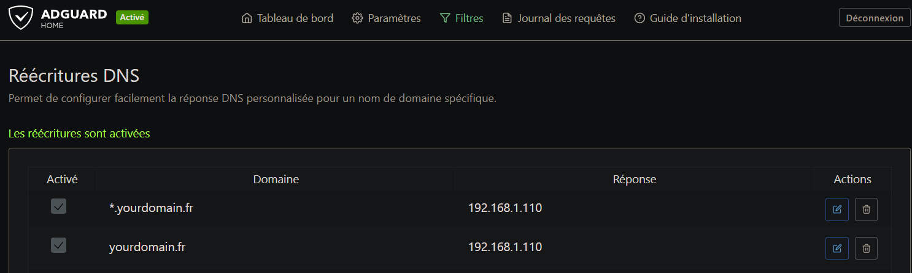

# Split DNS

### Understanding Split DNS



Tailscale's Split DNS feature is incredibly powerful for home lab users, allowing you to seamlessly integrate your private network with your local DNS resolver (like AdGuard Home or Pi-hole). This guide walks you through setting up a custom domain for your local services, choosing between using a purchased domain or a local-only domain.

When you enable Tailscale's Split DNS, you create a sophisticated networking environment:

* **Default Behavior:** All standard, non-homelab queries (e.g., browsing Google, checking news) continue to use your device's normal public DNS servers. Your internet experience remains unchanged.
* **Split Behavior (Local Domain):** Queries specifically directed to the domain you've configured in Tailscale (e.g., `*.yourdomain.fr`) are **redirected** to your local DNS resolver (like AdGuard Home or Pi-hole) running on your Tailnet.

**The Key Benefit:** This allows you to use clean, memorable hostnames like `adguard.yourdomain.fr` for internal applications, even if they aren't publicly exposed. The DNS resolution happens locally, removing the dependency on external DNS.

### How to setup in Proxmox

1. Create Adguard Home LXC (or [Pi-Hole](https://community-scripts.github.io/ProxmoxVE/scripts?id=pihole) if you prefer) [https://community-scripts.github.io/ProxmoxVE/scripts?id=adguard](https://community-scripts.github.io/ProxmoxVE/scripts?id=adguard). <mark style="color:$warning;">**Setup is on port 3000 and after that, dashboard is on port 80**</mark>
2. Create your Reverse Proxy in another LXC, for simplicity, we'll go [https://community-scripts.github.io/ProxmoxVE/scripts?id=npmplus](https://community-scripts.github.io/ProxmoxVE/scripts?id=npmplus)
3. Enable Split DNS in [https://login.tailscale.com/admin/dns](https://login.tailscale.com/admin/dns) for `yourdomain.fr` to points to your local Adguard LXC IP
4. Go to `Adguard Dashboard > Filters > DNS Rewrites`. Add 2 entries like this pointing towards NPM LXC IP:

<figure><figcaption></figcaption></figure>

5. In `NPM > TLS Certificates`. Add your 2 certificates (1 for `*.yourdomain.fr` and another for `yourdomain.fr)`. You only need to buy a domain if you want public access (it's useful for apps like immich or nextcloud where you want to be able to sync 24/24 for example). If you have bought your domain you can just use Let's Encrypt in NPM, but if you want to go local-only (free) domain, you'll need to generate a self-signed cert, check [#using-a-local-only-unpurchased-domain](split-dns.md#using-a-local-only-unpurchased-domain "mention").
6. `NPM > Proxy Hosts`. Add your each services.


A lot of apps need Websocket enabled in NPM



***

### Using a Local-Only (Unpurchased) Domain

You can use any domain name you like (e.g., `myhomelab.local`) without purchasing it, but this requires manual handling of TLS/SSL certificates.

#### The Self-Signed Certificate Challenge

Since public certificate authorities (CAs) cannot see or verify a domain that exists only on your local network, you **must** generate a self-signed certificate.

When using a self-signed certificate, your browser will display security warnings. To eliminate these warnings (and enable modern security features like HTTP/2), <mark style="color:$warning;">**you need to manually install and trust the generated**</mark><mark style="color:$warning;">**&#x20;**</mark><mark style="color:$warning;">**`.crt`**</mark><mark style="color:$warning;">**&#x20;**</mark><mark style="color:$warning;">**file on every device you use**</mark> <mark style="color:$warning;"></mark><mark style="color:$warning;">(on windows just double click it and add it to "trust certificates" store).</mark>

#### Script to Generate a Wildcard Self-Signed Certificate

This script generates a certificate valid for 100 years (36,500 days) for a wildcard domain (`*.YOURDOMAIN.FR`) and the root domain (`YOURDOMAIN.FR`).


```bash
DOMAIN=legoatdesserveurs.fr
NPM_IP=192.168.1.110

openssl req -x509 -nodes -days 36500 -newkey rsa:2048 \
    -keyout wildcard.key \
    -out wildcard.crt \
    -subj "/C=FR/ST=Local/L=Home/O=HomeLab/CN=*.$DOMAIN" \
    -addext "subjectAltName = DNS:*.$DOMAIN,DNS:$DOMAIN,IP:$NPM_IP"
```


You can then add it to NPM, and if you have bought a domain name, you don't need to generate your certificate, NPM can do it for you. To avoid creating requesting another cert for each subdomain you can ask a cert for \*.YOURDOMAIN.FR and reuse this for each proxy.
