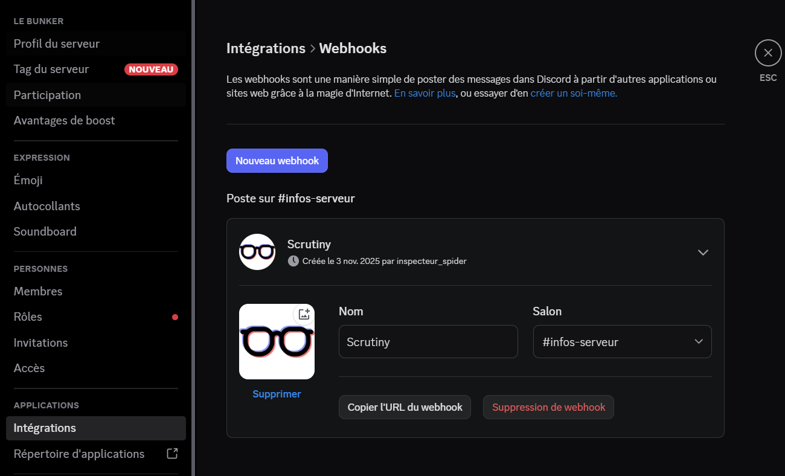

# HDD Monitoring Proxmox

## Scrutiny setup

### Web+DB

I opened a [PR](https://github.com/Dokploy/templates/pull/500) on Dokploy's Github, as of now it's pending but you can still use it by setting "Base URL" to: [https://kipavy-add-scrutiny-template.templates-70k.pages.dev/](https://kipavy-add-scrutiny-template.templates-70k.pages.dev/)&#x20;

If you don't want to use dokploy you can browse that link and just copy the docker-compose.yml from scrutiny template.

### Collector


The collector must be on proxmox host since LXCs don't have access to S.M.A.R.T data (it may be possible via VMs with PCI passthrough but I don't recommend it and haven't tried it)


For reference:





***


**The collector binary must match the Web image tag.** The Dokploy template above runs `ghcr.io/analogj/scrutiny:master-web`, but the script below downloads the **stable** `latest` collector. With a `master` web that binary is silently rejected — the collector logs `Device sda has no scrutiny UUID; skipping collection` and **no disk ever shows up**. If you use the `master`/`master-web` web, grab the matching `master` collector binary instead. There's no `master` binary on the releases page, so extract it from the collector image (run this in an LXC that has Docker, then copy it to the host):


```bash
# inside a Docker LXC (e.g. your docker CT):
docker create --name tmp-scm ghcr.io/analogj/scrutiny:master-collector
docker cp tmp-scm:/opt/scrutiny/bin/scrutiny-collector-metrics /root/scm
docker container rm tmp-scm
# then, on the PVE host:
pct pull <docker-ct-id> /root/scm /opt/scrutiny/bin/scrutiny-collector-metrics-linux-amd64
chmod +x /opt/scrutiny/bin/scrutiny-collector-metrics-linux-amd64
```



You can just change API\_ENDPOINT in the script to match your Scrutiny Web IP + Port and paste the script in proxmox shell.

```bash
#!/bin/bash

# CHANGE ME
API_ENDPOINT="http://192.168.1.xx:8080"


############# Scrutiny Collector ###################
apt install -y smartmontools
INSTALL_DIR="/opt/scrutiny"
BIN_DIR="$INSTALL_DIR/bin"
LATEST_RELEASE_URL="https://github.com/AnalogJ/scrutiny/releases/latest/download/scrutiny-collector-metrics-linux-amd64"

mkdir -p $BIN_DIR
curl -L $LATEST_RELEASE_URL -o $BIN_DIR/scrutiny-collector-metrics-linux-amd64
chmod +x $BIN_DIR/scrutiny-collector-metrics-linux-amd64

############## Scrutiny Service ####################
mkdir -p /root/scrutiny
cat << EOF > /root/scrutiny/scrutiny.sh
#!/bin/bash
/opt/scrutiny/bin/scrutiny-collector-metrics-linux-amd64 run --api-endpoint "$API_ENDPOINT" 2>&1 | tee /var/log/scrutiny.log
EOF
chmod +x /root/scrutiny/scrutiny.sh

cat << 'EOF' > /etc/systemd/system/scrutiny.service
[Unit]
Description="Scrutiny Collector"
Requires=scrutiny.timer

[Service]
Type=simple
ExecStart=/root/scrutiny/scrutiny.sh
User=root
EOF

cat << 'EOF' > /etc/systemd/system/scrutiny.timer
[Unit]
Description="Timer for the scrutiny.service"

[Timer]
Unit=scrutiny.service
OnBootSec=5min
OnUnitActiveSec=12h

[Install]
WantedBy=timers.target
EOF

systemctl daemon-reload
systemctl enable --now scrutiny.timer
systemctl status scrutiny.timer
```

You'll now have access to Scrutiny Dashboard on [http://192.168.1.xx:8080](http://192.168.1.xx:8080/)

### After a host reinstall (restore)


Web + InfluxDB live **in the LXC**, so they come back with your PBS restore — but the **collector lives on the PVE host** and is wiped when you reinstall PVE. Until you re-set it up, Scrutiny keeps showing the **old disks** (historical InfluxDB data) and **never shows the new ones** (nothing is collecting). That's the symptom, not a data-association bug.


1. Re-install the collector on the host — **matching the Web tag** (see the version warning above; for the `master` template, extract the `master` binary).
2. Run it once to confirm: `/opt/scrutiny/bin/scrutiny-collector-metrics-linux-amd64 run --api-endpoint "$API_ENDPOINT"`. New disks appear immediately.
3. **Remove ghost disks** (drives you've physically pulled — they never disappear on their own). Either the trash icon in the Web UI, or via the API with the device's WWN (get it from `…/api/summary`):

```bash
curl -X DELETE http://192.168.1.xx:8087/api/device/0x50XXXXXXXXXXXXXX
```


Put the collector cron/timer in a host-backed-up location if you can. A systemd unit under `/etc/systemd/system` (like the script above) **is** captured by the `/etc` backup — but the **binary** in `/opt/scrutiny` is not, so you'll still re-fetch it after a bare-metal restore.


### Configuring Alerting

Scrutiny supports webhook alerting through [Shouttr](https://containrrr.dev/shoutrrr/services/overview/), we'll set up discord alerting.

1. Get a discord webhook: create a server and a channel dedicated for Scrutiny

<figure><figcaption></figcaption></figure>

2. Create config/scrutiny.yaml based [example.scrutiny.yaml](https://github.com/AnalogJ/scrutiny/blob/master/example.scrutiny.yaml#L61-L85) with discord webhook matching [shouttr's url format](https://containrrr.dev/shoutrrr/v0.8/services/discord/#url_format).
3. You can try to trigger an alert with

```bash
curl -X POST http://192.168.1.xx:XXXX/api/health/notify
```

If it doesn't work try to restart or rebuild the scrutiny container.

