```mermaid
flowchart LR
    User((User))
    ServiceA[🛒 Order Service]
    Queue{📬 Message Queue}
    ServiceB[📧 Email Service]
    ServiceC[📦 Inventory Service]
    
    User -- "Place Order" --> ServiceA
    ServiceA -- "Publish: 'OrderCreated'" --> Queue
    
    Queue -.->|"Subscribe"| ServiceB
    Queue -.->|"Subscribe"| ServiceC
    
    ServiceB -- "Send Email" --> User
    ServiceC -- "Update Stock" --> DB[(Stock DB)]
```

# Architectural Patterns

### 1. MVC (Model-View-Controller)

**The "Classic" Pattern.**\
Used by frameworks like Ruby on Rails, Laravel, Django, and Spring Boot. This is essential for understanding how backend logic is structured.

* **The Concept:** Separation of concerns.
  * **Model:** The data (Database).
  * **View:** What the user sees (HTML).
  * **Controller:** The brain that connects them.

###

###

