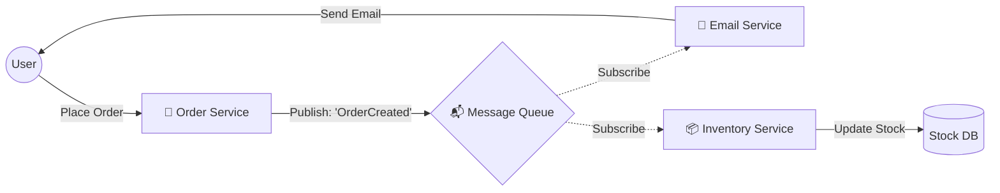
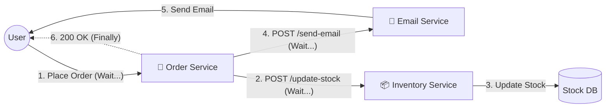

# Communication

### Async Event-Driven Architecture (Pub/Sub)

**The "Async" Pattern.**\
Useful when explaining background tasks (e.g., "User signs up, wait 5 minutes, then send welcome email"). This explains why we use tools like RabbitMQ, Kafka, or Redis.

* **The Concept:** Fire and Forget. The "Order Service" doesn't wait for the "Email Service" to finish. It just drops a message in a box (Queue).

| **✅ Performance:** User gets an instant "Success" response; heavy work happens in the background.              | **❌ Complexity:** Requires setting up and monitoring Message Queues (RabbitMQ/Redis).                 |
| -------------------------------------------------------------------------------------------------------------- | ----------------------------------------------------------------------------------------------------- |
| **✅ Resilience:** If the Email Service is down, the message stays in the Queue until it comes back online.     | **❌ Hard to Debug:** Tracing a bug is harder because the logic jumps between different servers/times. |
| **✅ Traffic Smoothing:** Spikes in traffic just fill up the queue; your servers process them at a steady pace. | **❌ "Eventual Consistency":** The user might refresh the page and not see the result immediately.     |

### Sync (HTTP/REST)

| **✅ Simplicity:** Easy to write and reason about (Step 1 -> Step 2 -> Step 3).                       | **❌ Latency:** The user has to wait for everything to finish (slow page loads).              |
| ---------------------------------------------------------------------------------------------------- | -------------------------------------------------------------------------------------------- |
| **✅ Immediate Feedback:** You know instantly if the operation failed (e.g., "Credit Card Declined"). | **❌ Coupling:** If one service (e.g., Email) goes down, the whole checkout process crashes.  |
| **✅ No Infrastructure:** You don't need to manage Redis, RabbitMQ, or Kafka.                         | **❌ Cascading Failures:** A traffic spike in Service A creates a traffic spike in Service B. |

