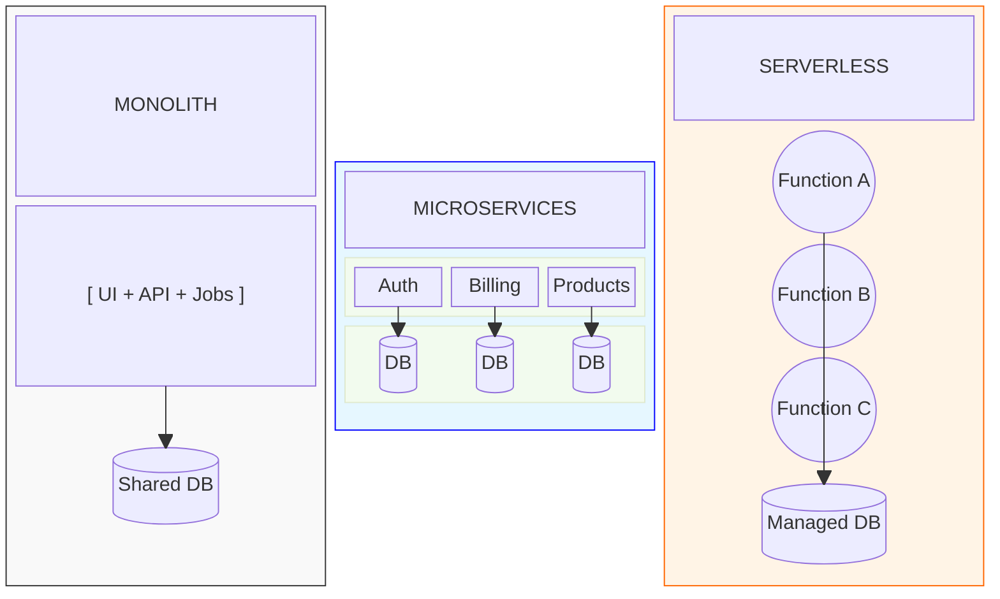

# Monolith vs. Microservices

**Monolith**

* **What is it?** All code (Frontend, API, Background Workers) lives in one repository and deploys together.
* **✅ Pros:** Easy to debug, easy to deploy, simple local development.
* **❌ Cons:** If one part breaks, everything breaks. Hard for 50+ developers to work on at once.
* **Verdicts:** Start here. 90% of apps should be monoliths.

**Microservices**

* **What is it?** Breaking the app into distinct services (e.g., a specific server just for PDF generation).
* **✅ Pros:** Scaling is precise (add more servers just for the busy part). Teams are independent.
* **❌ Cons:** "Distributed Monolith" hell. Extremely hard to debug. Requires DevOps experts.
* **Verdict:** Only use if you have 50+ developers or distinct scaling needs.

**Serverless**

* **What is it?** You don't manage servers. You upload functions (AWS Lambda, Vercel) that run only when triggered.
* **✅ Pros:** Infinite scaling, pay only for what you use ($0 if no users).
* **❌ Cons:** Cold starts (can be slow), vendor lock-in (hard to move off AWS).
* **Verdict:** Great for frontend-focused teams and side projects.

