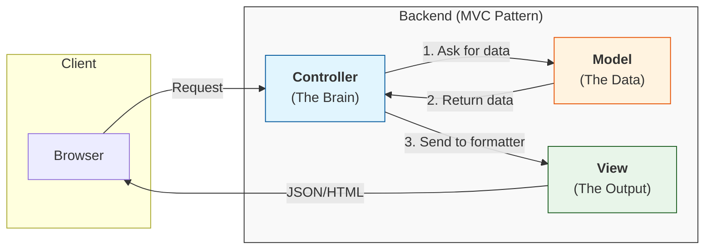

# MVC

```mermaid
flowchart LR
    subgraph Client
        Browser
    end

    subgraph Server ["Backend (MVC Pattern)"]
        direction TB
        Controller["<b>Controller</b><br/>(The Brain)"]
        Model["<b>Model</b><br/>(The Data)"]
        View["<b>View</b><br/>(The Output)"]

        Controller -- "1. Ask for data" --> Model
        Model -- "2. Return data" --> Controller
        Controller -- "3. Send to formatter" --> View
    end

    Browser -- "Request" --> Controller
    View -- "JSON/HTML" --> Browser

    style Server fill:#f9f9f9,stroke:#333
    style Controller fill:#e1f5fe,stroke:#01579b
    style Model fill:#fff3e0,stroke:#e65100
    style View fill:#e8f5e9,stroke:#1b5e20
```
