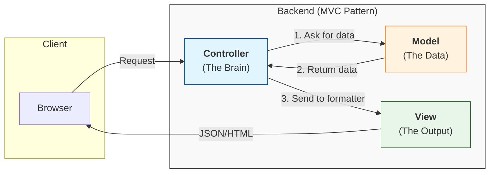

# MVC

> **Verdict:** The default way to organize backend code. If you're not sure how to structure a server, start here.

**MVC (Model–View–Controller)** splits your code into three jobs so no single file does everything:

* **Model** — the data and the rules around it (e.g. the `User` table and how to query it).
* **View** — the output the client receives (JSON for an API, or an HTML page).
* **Controller** — the "brain" that takes a request, asks the Model for data, and hands it to the View.

The point is **separation of concerns**: your data logic doesn't get tangled up with your formatting logic, so each part stays easy to change and test. Most backend frameworks (Django, Laravel, Rails, NestJS) are built around some flavor of this.

