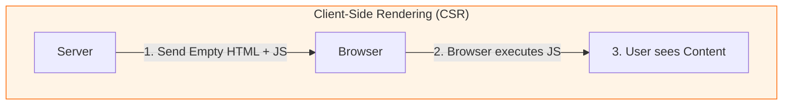
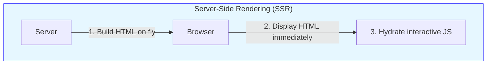
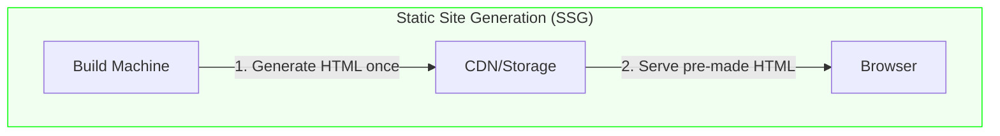

# Rendering Strategies

### CSR (Client-Side)

The browser does the work (Standard React).

### SSR (Server-Side)

The server does the work per request (Next.js/Remix).

### SSG (Static Generation

The work is done once at build time (Gatsby/Astro).

