# SPA vs. MPA

### **MPA (Multi-Page Application)**

The traditional web. Every click reloads the page.

```mermaid
sequenceDiagram
    participant Browser as 💻 Browser
    participant Server as ⚙️ Server (Django/Laravel)
    participant DB as 🗄️ Database

    Note over Browser: User clicks "Login"
    Browser->>Server: POST /login (Form Data)
    activate Server
    Server->>DB: Query User
    DB-->>Server: Return User Data
    
    Note right of Server: 🔨 Server renders HTML<br/>(Merges data into template)
    
    Server-->>Browser: 200 OK (New HTML Page)
    deactivate Server
    
    Note over Browser: 🔄 Full Page Refresh<br/>(Browser discards old page)
```

### **SPA (Single-Page Application)**

The modern web. The app loads once, and clicks just fetch data (JSON).

### Comparison

| **MPA** | Blogs, News Sites, E-commerce (Amazon) | Excellent SEO, Simple to build. | "Clunky" feel, screen flashes white on click. |
| ------- | -------------------------------------- | ------------------------------- | --------------------------------------------- |
| **SPA** | Dashboards, Social Networks, SaaS      | Smooth "App-like" feel.         | Harder SEO, heavy initial download.           |
