# Choosing the Stack

* **The Big 3:** React, Vue, Angular (pros/cons).
* **Backend choices:** Node.js, Python, Go, Rust.
* **Database:** SQL (Postgres/MySQL) vs. NoSQL (Mongo/Firebase).
* Write a "Decision Matrix" page here: How to choose based on project scale.

### 1. The Core Decision: Database First

This is often the most rigid part of your stack. Changing your database later is much harder than changing a frontend framework.

```mermaid
graph TD
    Start(["🚀 START: What describes your data?"])
    
    %% Branch 1: Relational (The Default)
    Start -->|"Users, Orders, Inventory<br/>(Structured Relationships)"| Relation["Do you have complex relationships?"]
    Relation -->|Yes| SQL_Main["<b>PostgreSQL</b><br/>(The Industry Standard)"]
    Relation -->|"Yes, but I want it simple/local"| SQLite["<b>SQLite</b><br/>(Great for rapid dev/mvp)"]

    %% Branch 2: Real-time / BaaS
    Start -->|"I need Real-time Sync<br/>(Chat, Collab, Live Dashboard)"| RT["Do you want to write a backend?"]
    RT -->|"No, handle it for me"| Firebase["<b>Firebase / Supabase</b><br/>(Backend-as-a-Service)"]
    RT -->|"Yes, I need custom control"| Redis["<b>Redis</b><br/>(Add this <i>alongside</i> SQL)"]

    %% Branch 3: Unstructured
    Start -->|"Logs, Content, Analytics<br/>(Unstructured/Flexible)"| NoSQL["<b>MongoDB</b><br/>(Document Store)"]

    %% Styling
    style SQL_Main fill:#e6f7ff,stroke:#00f,stroke-width:2px
    style SQLite fill:#f9f9f9,stroke:#333,stroke-width:2px
    style Firebase fill:#fffbe6,stroke:#f60,stroke-width:2px
```

#### 🏛 SQL (Relational)

Examples: PostgreSQL, MySQL, SQLite.

**Choose this if:**

* ✅ **Structure is known:** You have clear entities (Users, Orders, Inventory) with strict relationships.
* ✅ **Data Integrity is key:** You cannot afford "orphan" data (e.g., an Order without a User).
* ✅ **Complex Queries:** You need to join multiple tables to generate reports.

#### 📄 NoSQL (Document)

Examples: MongoDB, Firebase, DynamoDB.

**Choose this if:**

* ✅ **Unstructured Data:** You are storing logs, analytics, or user-generated content that varies wildly.
* ✅ **Speed of Iteration:** You need to change data models daily without writing migration scripts.
* ✅ **Real-time:** You need out-of-the-box syncing (e.g., Chat apps using Firebase).

### Frontend

```mermaid
graph TD
    Start(["🚀 START: What matters most?"])

    %% Branch 1: SEO & Performance
    Start -->|"SEO is Critical<br/>(E-commerce, Marketing)"| SSR["I need Server-Side Rendering"]
    SSR -->|"Standard Choice"| Next["<b>Next.js</b><br/>(The React Framework)"]
    SSR -->|"Vue Alternative"| Nuxt["<b>Nuxt</b><br/>(The Vue Framework)"]

    %% Branch 2: Dashboard / App
    Start -->|"Rich Interactive App<br/>(Dashboard, SaaS behind login)"| SPA["Single Page App (SPA)"]
    
    %% The SPA Choices
    SPA -->|"I want the biggest ecosystem<br/>(Libraries, Jobs, StackOverflow)"| React["<b>React (Vite)</b><br/>(The Safe Bet)"]
    SPA -->|"I want simplicity & clean code<br/>(Separation of HTML/JS)"| Vue["<b>Vue.js</b><br/>(The Balanced Choice)"]
    SPA -->|"I hate boilerplate / want raw speed"| Svelte["<b>Svelte</b><br/>(The Compiler)"]
    
    %% Branch 3: Enterprise
    Start -->|"Large Enterprise Team<br/>(Strict structure, Java/C# devs)"| Angular["<b>Angular</b><br/>(Batteries Included)"]

    style Next fill:#fffbe6,stroke:#000,stroke-width:2px
    style React fill:#e6f7ff,stroke:#00f,stroke-width:2px
    style Angular fill:#ffe6e6,stroke:#f00,stroke-width:2px
```

### Backend

```mermaid
graph TD
    Start(["🚀 START: Choose your Backend"])

    %% Branch 1: JavaScript / TypeScript
    Start -->|"I use TypeScript"| TS["TS / Node.js"]
    
    TS -->|"I want lightweight & Edge-ready"| Hono["<b>Hono</b><br/>(The Modern Standard)"]
    TS -->|"I want robust Enterprise structure"| Nest["<b>NestJS</b><br/>(Modular Architecture)"]

    %% Branch 2: Python
    Start -->|"I use Python (AI/Data)"| Py["Python"]
    Py -->|"The only modern choice"| FastAPI["<b>FastAPI</b><br/>(Async, Typed, Auto-Docs)"]

    %% Branch 3: Performance
    Start -->|"I need Max Performance"| Perf["Systems"]
    Perf -->|"Cloud Native"| Go["<b>Go</b><br/>(Microservices)"]
    Perf -->|"Safety & Speed"| Rust["<b>Rust</b><br/>(Critical Logic)"]

    style Hono fill:#e6f7ff,stroke:#00f,stroke-width:2px
    style FastAPI fill:#fffbe6,stroke:#f60,stroke-width:2px
    style Go fill:#f9f9f9,stroke:#333
```

express.js, django ?

tailwind?

ORM Prisma/Drizzle?

```mermaid
flowchart LR
    subgraph Setup ["1. The Scaffolding"]
        CLI[npm create vite] -- "Scaffolds" --> App[React/Vue App]
    end

    subgraph Dev ["2. Development"]
        Vite[⚡ Vite Server] -- "Serves" --> Browser
        Vite -- "Hot Reload (HMR)" --> Browser
    end

    subgraph Test ["3. Testing"]
        Vitest[🧪 Vitest] -- "Reuses Config" --> Vite
        Vitest -- "Simulates DOM" --> HappyDom[happy-dom]
    end

    App --> Vite
    App --> Vitest
    
    style Vite fill:#fffbe6,stroke:#f60,stroke-width:2px
    style Vitest fill:#e6f7ff,stroke:#00f,stroke-width:2px
```

