# API Design

### REST

* The Standard. Uses HTTP methods (GET, POST, PUT, DELETE).
* Best for: 95% of applications, public APIs, caching.

```mermaid
sequenceDiagram
    participant Client
    participant Server
    
    Note over Client: 1. Get User Details
    Client->>Server: GET /users/1
    Server-->>Client: 200 OK (Returns Name, Age, Email, Address...)
    Note right of Client: ⚠️ Over-fetching:<br/>We didn't need the Address.

    Note over Client: 2. Get User's Posts
    Client->>Server: GET /users/1/posts
    Server-->>Client: 200 OK (Returns List of Posts)
    Note right of Client: 🐢 Waterfall:<br/>Had to wait for User<br/>to get the ID.
```

### GraphQL

* The Query Language. The client asks for exactly what it needs.
* Best for: Complex data graphs, avoiding "Over-fetching" on mobile apps.
* Recommendation: **Stick to REST** unless you have a specific problem that GraphQL solves. It is simpler to cache and debug.

```mermaid
sequenceDiagram
    participant Client
    participant Server
    
    Note over Client: ONE Request for everything
    
    Client->>Server: POST /graphql<br/>query { user(id:1) { name, posts { title } } }
    
    Note right of Server: 🧠 Resolver figures it out
    
    Server-->>Client: 200 OK (JSON: { name: "Alice", posts: [...] })
    
    Note right of Client: ✨ Exact Data.<br/>No more, no less.
```

