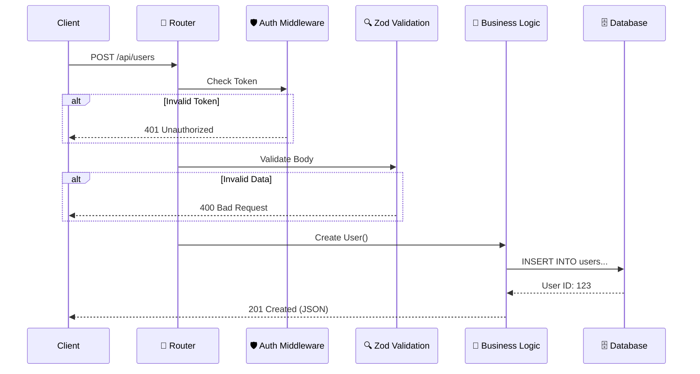

# Code Architecture

**Separation of Concerns**.\
Do not put database queries inside your API routes.

```mermaid
sequenceDiagram
    participant Client
    participant Router as 🚦 Router
    participant Auth as 🛡️ Auth Middleware
    participant Zod as 🔍 Zod Validation
    participant Logic as 🧠 Business Logic
    participant DB as 🗄️ Database

    Client->>Router: POST /api/users
    
    Router->>Auth: Check Token
    alt Invalid Token
        Auth-->>Client: 401 Unauthorized
    end
    
    Router->>Zod: Validate Body
    alt Invalid Data
        Zod-->>Client: 400 Bad Request
    end
    
    Router->>Logic: Create User()
    Logic->>DB: INSERT INTO users...
    DB-->>Logic: User ID: 123
    Logic-->>Client: 201 Created (JSON)
```
